<div align="center">

# 🕵️‍♂️ VulnMap
### Automated Context-Aware Vulnerability Scanner

[](https://www.python.org/)
[](https://github.com/Xzar-x/vulnmap)
[](LICENSE)

---
<p align="center">
  
</p>

**VulnMap** is a powerful, automated reconnaissance and vulnerability scanning framework designed to streamline the pentesting process. It intelligently categorizes assets, bypasses WAFs with smart rate-limiting, and generates AI-ready reports for further analysis.

[Features](#-features) • [Installation](#-installation) • [Usage](#-usage) • [Workflow](#-workflow) • [Disclaimer](#-disclaimer)

---

</div>

## 🚀 Features

| Feature | Description |
| :--- | :--- |
| **🧠 Context-Aware** | Intelligently categorizes assets (APIs, JS files, Parameters) for targeted scanning. |
| **🛡️ WAF Evasion** | Built-in `WafHealthMonitor` detects blocking and adjusts scan speed in real-time. |
| **🤖 AI-Ready** | Generates optimized text summaries (`wyniki.txt`) for LLM-based vulnerability analysis. |
| **📊 Rich Reporting** | Creates interactive, beautiful HTML reports for easy navigation of findings. |
| **🔧 Modular Core** | Integrates best-in-class tools: `nuclei`, `httpx`, `dalfox`, `wpscan`, `testssl.sh`, and more. |
| **🕹️ Interactive CLI** | Retro-styled, keyboard-driven interface powered by `rich` and `typer`. |

## 📦 Installation

VulnMap comes with an automated installer that handles system dependencies (Go, Python) and external tools.

```bash
# 1. Clone the repository
git clone https://github.com/Xzar-x/vulnmap.git
cd vulnmap

# 2. Run the installer (requires sudo for system packages)
sudo python3 install.py
```

> [!NOTE]
> The installer will automatically setup tools like `nuclei`, `httpx`, `dalfox`, `testssl.sh`, and `lfimap`. It works best on Kali Linux, Debian, or Ubuntu.

## 💻 Usage

### Basic Scan
Start a scan against a single target (URL or IP):

```bash
vulnmap https://example.com
```

### Import from ShadowMap
Process a JSON report from ShadowMap/previous scans:

```bash
vulnmap -i report.json
```

### Full Automation
Run all phases (Passive -> Active -> Infra) automatically:

```bash
# Inside the interactive menu, press 'a'
```

## 🔄 Workflow

```mermaid
graph TD
    A[Input Target/File] -->|Phase 0| B(Ingest & Categorize)
    B --> C{Main Menu}
    C -->|1| D[Phase 1: Passive Scan]
    C -->|2| E[Phase 2: Active App Scan]
    C -->|3| F[Phase 3: Infra Scan]
    C -->|a| G["Full Automation 1->2->3"]

    D --> H[Findings]
    E --> H
    F --> H

    H --> I[Generate Reports]
    I --> J["📄 AI Summary (txt)"]
    I --> K["📊 Interactive HTML"]
```



## 🧩 Modules & Tools

VulnMap leverages a powerful suite of tools:

- **Recon**: `httpx`, `subfinder` (via nuclei), `gau`, `waybackurls`
- **Scanning**: `nuclei` (custom templates), `dalfox` (XSS), `lfimap` (LFI), `sqlmap`
- **Infrastructure**: `nmap`, `testssl.sh`
- **CMS**: `wpscan` (WordPress)

## ⚠️ Disclaimer

> [!IMPORTANT]
> **VulnMap is for EDUCATIONAL PURPOSES and AUTHORIZED PENTESTING ONLY.**
> Usage of this tool for attacking targets without prior mutual consent is illegal. It is the end user's responsibility to obey all applicable local, state, and federal laws. Developers assume no liability and are not responsible for any misuse or damage caused by this program.

---

<div align="center">
  <sub>Made with ❤️ by Xzar & Gemini</sub>
</div>
